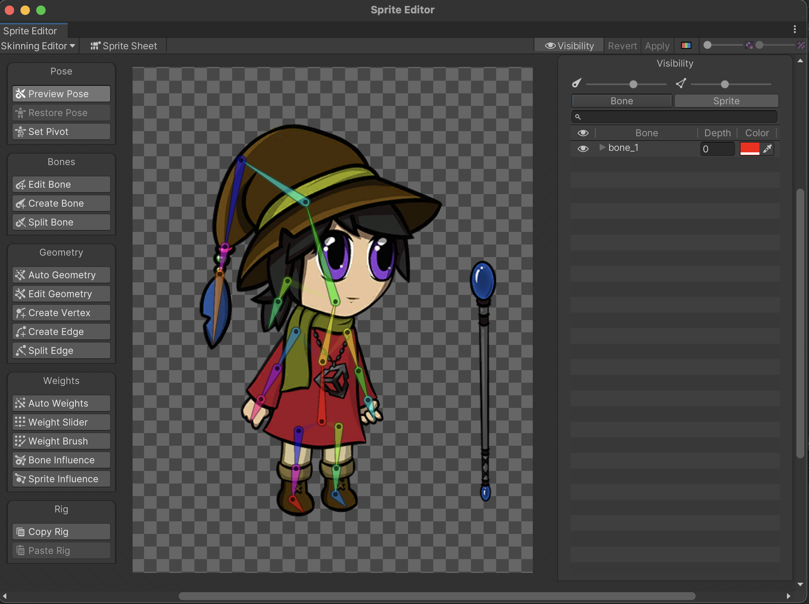

# Rigging a character imported with the PSD Importer
This sample demonstrates how to rig an actor that is made from multiple Sprites, when its source file is imported with the [PSD Importer](https://docs.unity3d.com/Packages/com.unity.2d.psdimporter@latest/). This example requires the PSD Importer to be installed.

Open the Asset `Assets/Samples/2D Animation/[X.Y.Z]/Samples/4 Character/Sprites/Fei.psb` in the [Skinning Editor](SkinningEditor.md) module to examine how the Sprite is rigged.

The `_Character` sample Scene shows how the Asset is used in a Scene, when it is animated  with animation that [deforms](SpriteSkin.md) its Sprite mesh.

Follow the steps below to reconstruct the `_Character` sample Scene:

1. In this sample, the source file `Fei.psb` is imported into the Editor with the PSD Importer with its **Character Rig** property enabled. The importer generates a Prefab as a sub-Asset of the imported source file. The importer generates Sprites based on the layers of the source file.

2. In this sample, the actor's bones are already rigged and weighted. Experiment editing the bones and mesh with the Skinning Editor's [various tools](SkinEdToolsShortcuts.md).

3. Drag the generated Prefab from the Project window into the Scene. This becomes a GameObject named 'Fei'.

4. Add the [Animator component](https://docs.unity3d.com/Manual/class-Animator.html) to the 'Fei' GameObject. Locate the Fei [Animator Controller Asset](https://docs.unity3d.com/Manual/Animator.html) in `Assets/Samples/2D Animation/[X.Y.Z]/Samples/4 Character/Animation/Animators/Fei.controller` and assign this Asset to the Animator’s **Controller** property.
