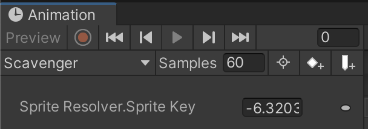
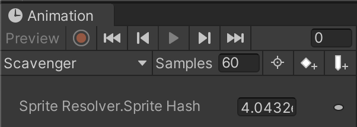

# What's new in version 8.0
The Sprite Resolver has been changed in 2D Animation version 8.0 onwards so that when the component is keyframed in the Animation window, the value is now stored in a parameter called **Sprite Hash**.

In previous versions of the 2D Animation package, when keyframing the Sprite Resolver, each individual key would have to be set up to properly swap to the intended Sprite. With this new parameter, there is no need for this additional setup step, you can record the intended swap and it will playback the expected swap accordingly.

## Added
- Added **Character Pivot** tool to the [Skinning Editor](SkinningEditor.md)

- Added the [2D Animation Asset Upgrader](AssetUpgrader.md) tool to upgrade Sprite Library Assets and Animation Clips to be compatible with 2D Animation package version 8.0 and onwards.

- Added **Sprite Hash** parameter
 The previous Sprite Resolver key. 
 The Sprite Resolver key from Animation 8.0 onwards.

## Updated
- Animation quality-of-life improvements including:
  - Support Sprite deformation, Sprite Swap and IK Solvers in Animation preview windows
